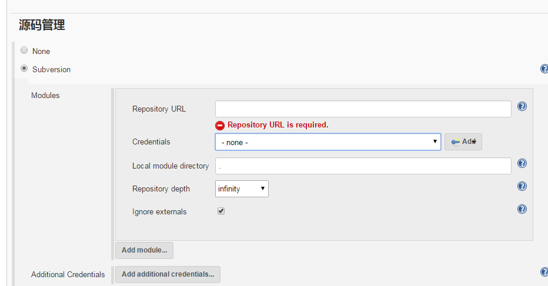

# Jenkins 证书

 当我们创建一个job需要访问一些代码,比如svn代码仓库等,就需要认证, 如图:
 

如果我们有很多job都需要配置认证, 那么是一件很繁琐的操作. 这里借助[jenkinsapi](https://github.com/pycontribs/jenkinsapi)来实现对证书的操作:

```python
# -*- encoding: utf-8 -*-
"""
注意,为了简单暂时关闭了crumb
"""

import hashlib

import requests
from jenkinsapi.credential import UsernamePasswordCredential
from jenkinsapi.jenkins import Jenkins as JenkinsEx


class JenkinsSvnCredentialManager(object):
    def __init__(self, jenkins_url, username, password):
        self.jenkins_url = jenkins_url
        if self.jenkins_url[-1] == "/":
            self.jenkins_url = self.jenkins_url[:-1]
        self.jenkins = JenkinsEx(self.jenkins_url, username=username,
                                 password=password)
    
    def _get_svn_md5(self, svn):
        m = hashlib.md5()
        m.update(svn)
        return m.hexdigest()
    
    def _get_or_create_svn_credential(self, svn, username, password):
        creds_description = self._get_svn_md5(svn)
        if creds_description not in self.jenkins.credentials.keys():
            cred_dict = {
                'description': creds_description,
                'userName': username,
                'password': password
            }
            self.jenkins.credentials[creds_description] = UsernamePasswordCredential(cred_dict)
        
        return self.jenkins.credentials[creds_description].credential_id
    
    def _check_credential(self, svn, credential_id):
        check_svn_url = "{jenkins_url}/job/tmp/descriptorByName/hudson.scm.SubversionSCM$ModuleLocation/checkCredentialsId".format(
            jenkins_url=self.jenkins_url)
        
        r = requests.get(check_svn_url, params={
            'value': credential_id,
            'remote': svn
        })
        return r.text == "<div/>"
    
    def get_svn_credential(self, svn, username, password):
        credential_id = self._get_or_create_svn_credential(svn, username, password)
        if not self._check_credential(svn, credential_id):
            del self.jenkins.credentials[self._get_svn_md5(svn)]
            raise Exception("check credential failed")
        return credential_id


jscm = JenkinsSvnCredentialManager('http://ip:8080', username='username',
                                   password='token')
print jscm.get_svn_credential("svn", 'username',
                              'password')

```

说明:   

1. 代码对svn地址做了一个md5计算, 避免重复添加认证.   
2. `get_svn_credential`会获取一个表示认证的id,不存在则根据用户名和密码创建. 这个id可用于使用脚本创建job时使用.


